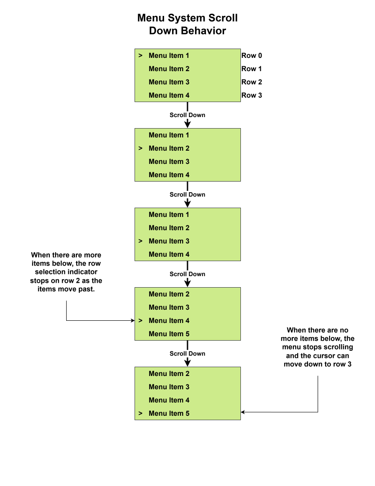
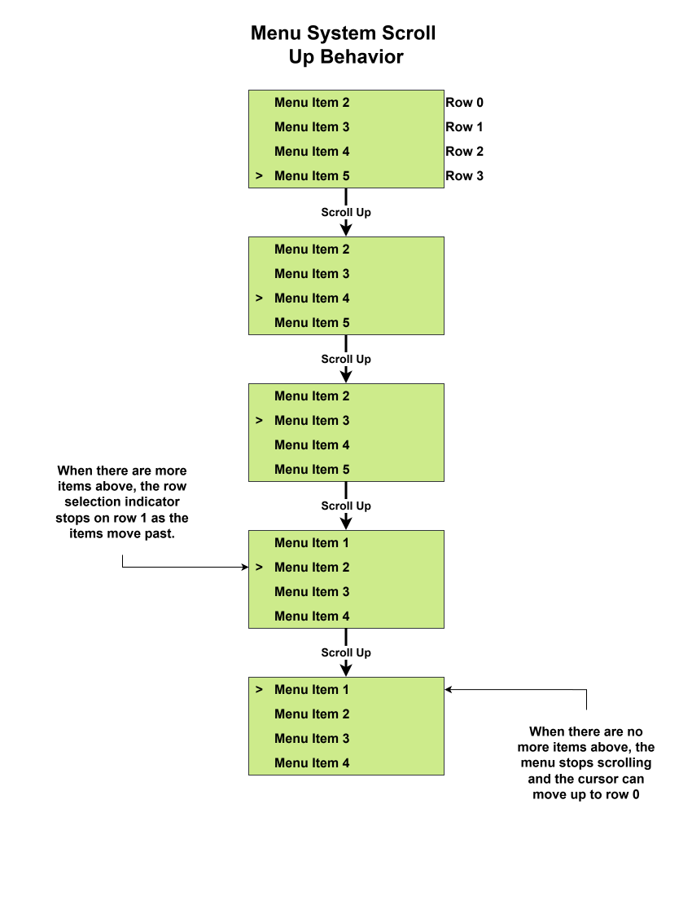
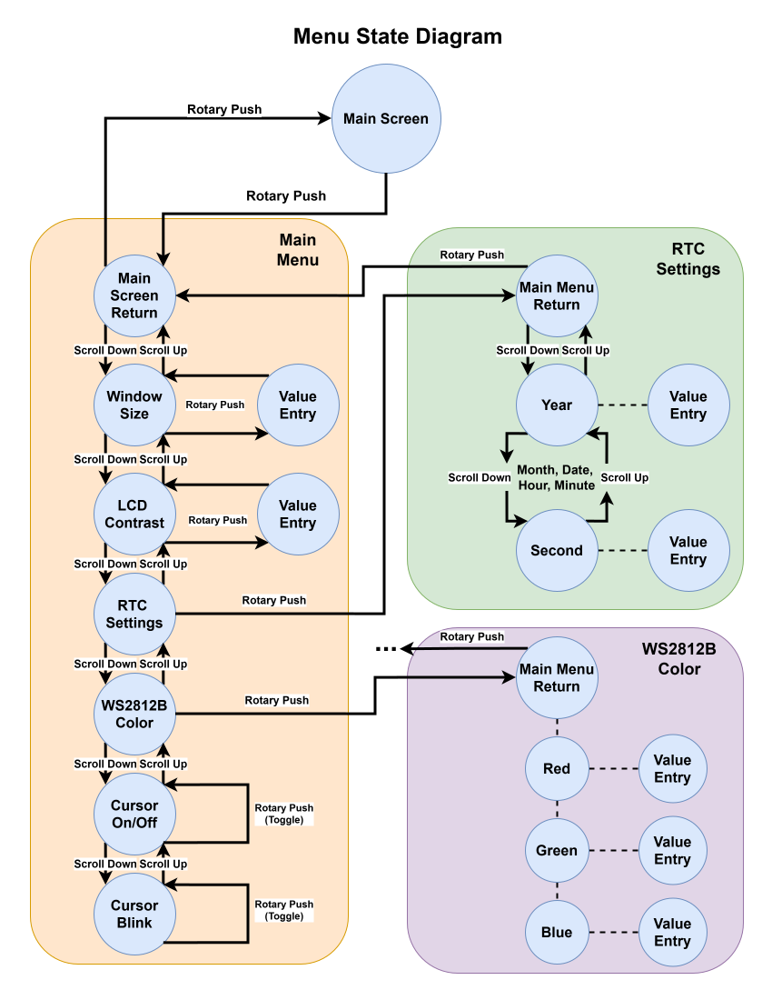

# Menu System Notes

## Menu Hierarchy
- Main screen
- Window size
- LCD contrast
- RTC settings
	- Main menu
	- Year
	- Month
	- Date
	- Hour
	- Minute
	- Second
- WS2812B color
	- Main menu
	- Red
	- Green
	- Blue
- Cursor On/Off
- Cursor Blink

## Menu Scrolling

- LCD is 20x4
	- We can fit every line into 20 chars, so no need for left/right scrolling
	- Multiple menus have more than 4 items, so we will need to have the display scroll to access any items on "rows" out of view.

### Menu scrolling method

- Scrolling Down
	- User scrolls to menu item second from the bottom of screen.
	- User scrolls down again. This will cause the screen to move one row.
	- If there are no more rows to display below, the screen stops moving and the row selection indicator can move to the bottom row.

- Scrolling Up
	- The same method as scrolling down is applied except the row selection indicator will sit on the row second from the top until the first menu item is displayed in row 0. Then the indicator will move to the top row.

## Menu System State Machine

